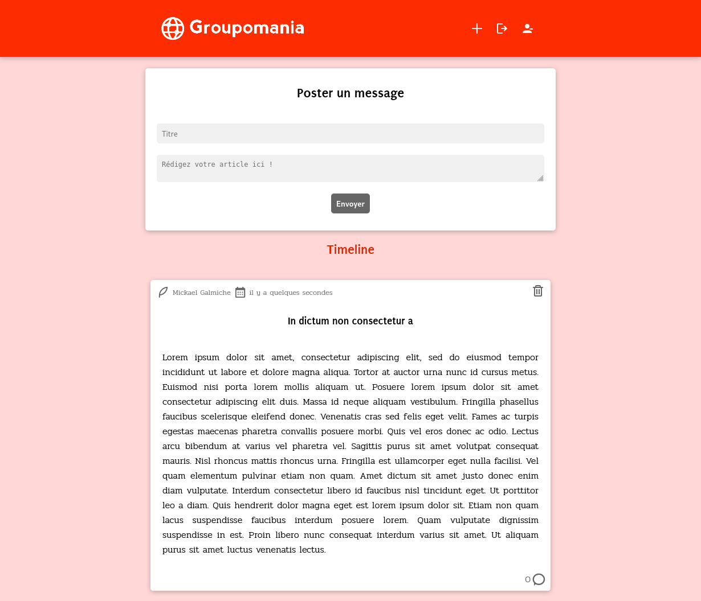

# Groupomania - projet Openclassrooms
Septième et dernier projet du parcours **développeur web**, dont l'objectif est de créer le réseau social interne d'une entreprise nommée Groupomania, en développant l'une des deux fonctionnalités proposées afin d'améliorer la communication et faciliter les interactions entre employés.

## Éléments fournis par l'entreprise virtuelle
- Les spécifications fonctionnelles de l'application ([fichier PDF à télécharger](https://s3-eu-west-1.amazonaws.com/course.oc-static.com/projects/DWJ_FR_P7/Groupomania_Specs_FR_DWJ_VF.pdf))
- Le logo de l'entreprise sous différents formats ([Archive à télécharger](https://s3-eu-west-1.amazonaws.com/course.oc-static.com/projects/DWJ_FR_P7/Groupomania_Logos+(3).zip))

## Installation
- Cloner le repository
- Suivre les instructions d'installation

### [Partie Backend](/Backend/README.md) : Lancer l'API
- Exécuter la commande `npm install dans le dossier **Backend**
- Créer un fichier *.env* contenant les variables **DATABASE_URL** (chaîne permettant la connexion à la base de données) et **TOKEN_KEY** (chaîne pour l'encodage du token). Une modification du port peut également être ajoutée avec la variable **PORT** (*3000* par défaut).
- Modifier le fournisseur de la base de données du fichier Schema.prisma si nécessaire (*mysql* par défaut)
- Appliquer le schéma à la base de données avec la commande `npx prisma migrate dev`.
- Démarrer le serveur avec la commande `npm start`.

### [Partie Frontend](/Frontend/app/README.md) : Lancer l'application Vue
- Exécuter la commande `npm install` dans le dossier **Frontend/app**.
- Créer un fichier *.env* contenant la variable **VUE_APP_API** (correspond à l'url de l'API du Backend)
- Démarrer le serveur avec la commande `npm run serve`.

## Cahiers des charges

Création d'un réseau social interne, moderne et ludique

### Fonctionnalités ###

- Présentation simple des fonctionnalités
- Création de compte :
    - Simple
    - Réalisable depuis un téléphone mobile
    - Rapide / Peu d'informations à compléter
- Suppression de compte : À intégrer
- Forum :
    - Accès à la publication de contenu (multimédia, texte)
    - Chronologie des dernières publications/participations des employés / Timeline
- Modération des intérations entre salariés : Fonction qui incombe au/à la chargé-e de communication Groupomania

### Contraintes techniques ###

- Organisation "agile"
- Estimer le temps de développement
- Respect des standards WCAG

- Langages :
    - Framework Front-End (Vue, React, Angular, Meteor, Aurelia)
    - Javascript only (pas de Php/Symfony)
    - Base de données relationelle (SQL)

- Fonctionnalités :
    - Deux briques de fonctionnalités de partage : GIF (ex: 9GAG) ou texte/article (ex: Reddit)
    - Choix/développement/présentation d'une seule brique pour le moment
    - Données de connexion sécurisées
    - Persistance de la session d'utilisateur